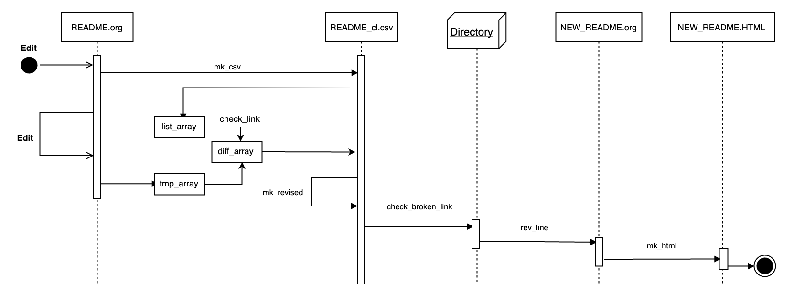

-   

課題2
-----

1.  jekyllへ変換する流れをシーケンス図で描く．
    -   done
2.  jekyllを動かせるように(Public)．
    -   done
3.  jekyllを動かした時の問題点を書く．
    -   Invalid theme folder: ~includes~ error とは何か
    -   Build Warning: Layout \'post\' requested in
        ~posts~/2019-07-01-welcome-to-jekyll.markdown does not exist.
        GitHub Metadata: No GitHub API authentication could be found.
        Some fields may be missing or have incorrect data. とは何か
    -   

4.  PDFのリンクでいいのか新しい事をするのかを見極める．
    -   later...
