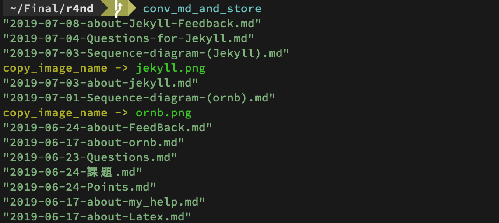
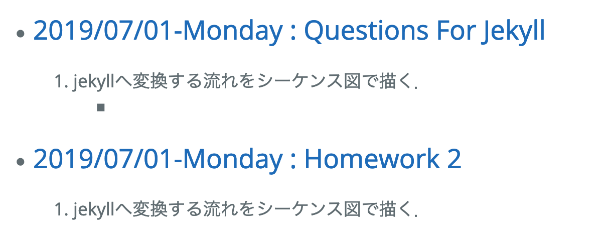
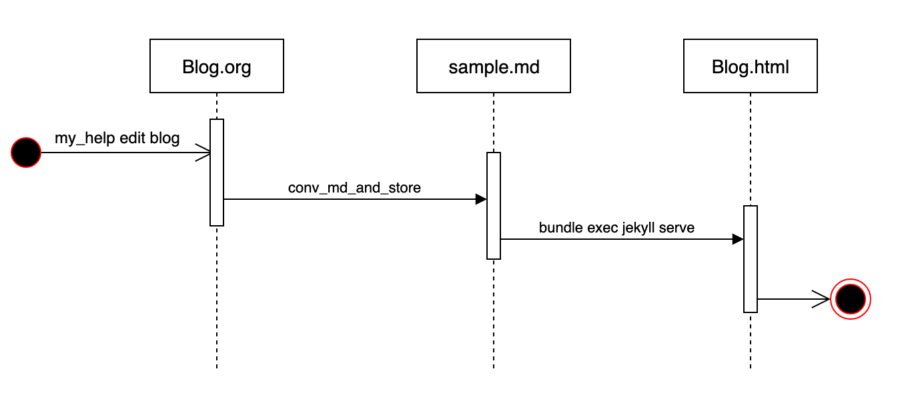

# Table of Contents

1.  [feedback](#org3df4e08)
2.  [Homework &lt;2019-07-28 Sun 14:09&gt;](#orgb2bc24e)
    1.  [about png](#org02f0b4e)
        1.  [HowTo](#org7c66e10)
    2.  [about underline](#org0cb18cd)
    3.  [about emphasis](#org3b78078)
3.  [feedback &lt;2019-07-22 Mon 11:49&gt;](#org4e30b53)
    1.  [6番を卒業研究として行う](#org9fe9351)
4.  [till Monday &lt;2019-07-18 Thu 22:35&gt;](#org826ef9b)
5.  [feedback &lt;2019-07-15 Mon 13:51&gt;](#orgea2ec2f)
6.  [about conv and jekyll (Qiita) &lt;2019-07-11 Thu 14:34&gt;](#orgb687463)
    1.  [org-modeからJekyllに変換した際にorg内で記述した画像ファイルがJekyllに反映されない問題の解決方法](#orgf670e81)
    2.  [Jekyll(Theme:cayman)でorg-mode編集日時の反映方法](#org675f873)
    3.  [[追記]conv後に生成されるtmpファイルと編集で削除した記事をhtmlに反映させない様にする方法](#org3643186)
7.  [about Jekyll Feedback &lt;2019-07-08 Mon 11:23&gt;](#org03366c3)
    1.  [How to remove .md file in \_posts](#org54d4a93)
8.  [Questions for Jekyll &lt;2019-07-04 Thu 23:20&gt;](#orgdaf6c8c)
9.  [Sequence diagram (Jekyll) &lt;2019-07-03 Wed 14:05&gt;](#org7c8d2d0)
10. [about jekyll &lt;2019-07-03 Wed 13:59&gt;](#org8e2c21d)
    1.  [How to install Jekyll](#org3e2bbf0)
    2.  [How to change org-mode to Jekyll](#orga463364)
        1.  [Questions](#org427dc40)
11. [Sequence diagram (ornb) &lt;2019-07-01 Mon 12:09&gt;](#orgaf24cd1)
12. [about ornb &lt;2019-06-17 Mon 15:15&gt;](#orgdb8e901)
    1.  [Questions &lt;2019-06-23 Sun 12:22&gt;](#orgef56cb4)
        1.  [河野](#orgaa7897d)
    2.  [課題 &lt;2019-06-24 Mon 12:21&gt;](#orgb9f9168)
13. [about my\_help &lt;2019-06-17 Mon 14:05&gt;](#orgc5fdcc4)
    1.  [How to install my\_help](#org8f71dd9)
    2.  [How to edit my\_help](#orgd9ef793)
        1.  [about timestamp](#orgec60501)
        2.  [about URL](#orgade8451)
    3.  [How to show on my iPhone](#org53ad835)
14. [about Latex &lt;2019-06-17 Mon 14:21&gt;](#org6f0cad3)

# feedback

# Homework &lt;2019-07-28 Sun 14:09&gt;

## about png

-   done

### HowTo

-   参照
    -   <https://takezoe.hatenablog.com/entry/20140629/p1>

-   問題点
    -   orgからmdに１回で変換する際にimgが含まれる一文にバックスラッシュがどうしても入る.

-   解決法
    1.  \_posts内のmdファイルをもう一度読み込む.
    2.  mdファイルにimgの一文を含んでいると抽出.
    3.  バックスラッシュが入っているとそれを取り除くき上書きする.

-   test
    -   

-   pngの表示ができるとアンダーラインと強調も同様に出来る

## about underline

-   not yet

## about emphasis

-   not yet

# feedback &lt;2019-07-22 Mon 11:49&gt;

## 6番を卒業研究として行う

1.  pandocを使う
2.  emacs内の機能マークダウン
3.  batch（河野に聞く）
4.  jekyllの中で検索かけれたら便利かも
    -   orgmodeからの変換が有るか無いかを検索
5.  orgmode::parser
6.  tabelはhtmlに変換して組み込み
    -   latexを変換とか
7.  okdの英単語抽出に対するテーマを探してきてテストできる様に
    -   単語帳にあうテーマを作る

# TODO till Monday &lt;2019-07-18 Thu 22:35&gt;

1.  jekyllでpng見れる様に
    -   調べたけどでてこない
    -   もう１週間粘る

2.  jekyllでunderline使える様に
    -   もう１週間粘る

3.  treeで検索できる様に（demo,紙に起こすだけでも)
    -   動作の流れ，何を実現したいか

4.  search command みたいな作ったら面白いかも
    -   titleじゃなくて分の中身の一部とマッチしたらそのファイルの名前orパスを表示してくれるとか
    -   キーワード検索できる様に
        -   search >> xxx, yyy 
            -   該当ファイルまでのPathを表示とか
    -   .txt ot .org とかで試そうかな

5.  grepがそれかな

6.  makemd(旧conv\_md\_and\_store)を改良してorgのunderlineや強調，テーブル，TODO, チェックボックスも反映できる様に改良していくのはどうか
    -   pngを移せる様になった感じで改良加えていく.

1.  Rakefileをもらい実際にpdf化してみる(卒検用）

# feedback &lt;2019-07-15 Mon 13:51&gt;

1.  jekyll png
2.  jekyll underline
3.  conv 書き換え
4.  treeを検索できる様に
    -   ディレクトリのルール(ex.文章管理)

# about conv and jekyll (Qiita) &lt;2019-07-11 Thu 14:34&gt;

## org-modeからJekyllに変換した際にorg内で記述した画像ファイルがJekyllに反映されない問題の解決方法

-   conv\_md\_and\_storeファイルに下記のコードを追加

>     $target2 = File.join ENV['HOME'],'.my_help/img/' #各自のディレクトリ名に変更
>     $jekyll_img_path = File.join ENV['HOME'],'Final/r4nd/img/' #各自のディレクトリ名に変更

解説

-   $target2は.my\_helpディレクトリに画像専用のディレクトリを作りそこまでのpathとする．
-   Jekyll\_img\_pathはJekyllのディレクトリ内に画像専用ディレクトリを作り，そこまでのpathとする．

>     img = line.match /\[\[file:(.*)\/(.*)\]\]/
>     if img != nil
>       img_path = $target2 + img[2]
>       puts 'copy_image_name -> '.yellow + img[2].green
>       FileUtils.cp(img_path, $jekyll_img_path)
>     end

解説

-   orgファイルを１行ずつ読み，画像ファイルの名前だけを抽出．(img[2])
-   その中身を.my\_help内のimgディレクトリからJekyll内のimgディレクトリへコピーする．

結果

.

## Jekyll(Theme:cayman)でorg-mode編集日時の反映方法

-   JekyllのDirectory内にblog.mdを作り以下のコードを入力する

>     <h1>Latest Posts</h1>
>     <ul>
>     
>     <li>
>     <h2><a href="{{ post.url | relative_url }}">
>     {{ post.date | date: '%Y/%m/%d-%A' }} : {{ post.title }}
>     </a></h2
>     
{{ post.excerpt }}

>     </li>
>       
>     </ul> 

結果

.

## [追記]conv後に生成されるtmpファイルと編集で削除した記事をhtmlに反映させない様にする方法

>     FileUtils.rm(Dir.glob('/Users/youssefomri/Final/r4nd/_posts/*'))

-   自分のjekyllディレクトリにある\_posts内の.mdファイルを削除する.

# about Jekyll Feedback &lt;2019-07-08 Mon 11:23&gt;

-   org-modeからJekyllにした時にpngが表示されない問題の解決.
    -   done

-   jekyllで時間表示をできるようにする.
    -   done

-   Qiitaに紹介記事を書くつもりで1,2を解決する.

## How to remove .md file in \_posts

>     - Dir.glob(dir) 
>        each do | dirs
>       if includes?(dirs) == jekyll(title)
>       rm (dirs) > fileUtiles

# Questions for Jekyll &lt;2019-07-04 Thu 23:20&gt;

1.  jekyllへ変換する流れをシーケンス図で描く．
    -   done

2.  jekyllを動かせるように(Public)．
    -   done

3.  jekyllを動かした時の問題点を書く．
    1.  jekyllにするとorg-modeで書いたpngが反映されない
    2.  新しくblogを編集（削除など）しても昔の.mdが残っている
        -   反映されていない？(\_postsとconvで作成された.mdファイルとの差分を削除出来ていない）

4.  PDFのリンクでいいのか新しい事をするのかを見極める．
    -   later&#x2026;

# Sequence diagram (Jekyll) &lt;2019-07-03 Wed 14:05&gt;

-   

# about jekyll &lt;2019-07-03 Wed 13:59&gt;

## How to install Jekyll

1.  Qiita jekyll install で検索 ->  **[here](https://qiita.com/daddygongon/items/9b7182db29861744fc79)**
2.  gem install bundler jekyll
3.  jekyll new xxx
4.  bundle exec jekyll serve

5.  立ち上がったか確認
6.  Qiitaに沿って進める
7.  daddygongon(github/jekylle\_test9)をcloneする(※他の場所で)
8.  \_data, \_includes, \_posts, \_layouts, \_sass, assets, about.md, index.mdをmvする
9.  bundle update (変更毎に）
10. 自分の名前になっているか確認

## How to change org-mode to Jekyll

1.  Qiita org-mode Jekyll で検索 ->  **[here](https://qiita.com/daddygongon/items/d803d9ce6d75bef3179a)**
2.  emacs conv\_md\_and\_store.rb
3.  chmod a+x conv\_md\_and\_store.rb
4.  mv conv\_md\_and\_store.rb conv\_md\_and\_store
5.  mv conv\_md\_and\_store ~/bin/
6.  conv\_md\_and\_store
    -   org-rubyがエラーで出たら
        -   gem install org-ruby
7.  brew upgrade rbenv ruby-build
8.  brew upgrade ruby-build
9.  brew install pandoc
10. \_posts の中にblog内fileが.md形式で作られているかを確認
11. htpp://localhost:4000/でblogが反映しているかを確認
    -   rm 2019-07-01-welcome-to-jekyll.markdown してもいいよ
12. END

### Questions

-   rbenv install 2.6.3
-   rbenv global 2.6.3
    -   My\_help(2.5.1)やから使えんくなった
    -   my\_help を rbenv(2.6.3)に対応させるには？（my\_helpはちゃんと上書きされるのか？)
-   rm 2019-07-01-welcome-to-jekyll.markdown

# Sequence diagram (ornb) &lt;2019-07-01 Mon 12:09&gt;

-   

# about ornb &lt;2019-06-17 Mon 15:15&gt;

-   Browse **[here](https://ist.ksc.kwansei.ac.jp/~nishitani/?MBTheses)**

## Questions &lt;2019-06-23 Sun 12:22&gt;

### 河野

1.  orgファイルからどのようにしてpdfファイルを抽出しcsvファイルにするのか
    -   読み込むパッケージを使いorgを1行ずつ読み込み正規表現を使い.pdfと一致するものがあればcsvに書き込む.

2.  Citation List とは
    -   csvファイルの内容内のpdfファイルの集合のこと.

3.  diff\_array の作り方は add\_link と何か
    -   README.orgになんらかの編集が加えられば，今と昔のCitation listの差分が格納されたArray.

4.  どのようにしてorg編集毎にpdfのリンクを追加するのか
    -   追加するコマンド有り.

## 課題 &lt;2019-06-24 Mon 12:21&gt;

-   ユースケース図(動作が起こる一連の流れの図)

-   シーケンス図を作る
    -   Browse **[Draw.io](https://www.draw.io/)**

-   UML(Unified Modeling Language)

-   Rspec : 出力と結果を比較する

-   Rubocop : コードの中身を見る，コードのスタイルをチェックする

-   Thor : コマンドラインを作るアプリケーション

# about my\_help &lt;2019-06-17 Mon 14:05&gt;

## How to install my\_help

1.  gem install my\_help
2.  my\_help list
3.  my\_help new blog
4.  my\_help edit blog
5.  write #+SETUPFILE (or download)

## How to edit my\_help

### about timestamp

-   C-u > C-c > .
-   C-c > .

### about URL

1.  C-c > C-l

## How to show on my iPhone

-   Browse **[here](https://qiita.com/daddygongon/items/e1495e95b1a0453c1084)**

# about Latex &lt;2019-06-17 Mon 14:21&gt;

-   Browse **[here](http://osksn2.hep.sci.osaka-u.ac.jp/~taku/osx/install_ptex.html)**

